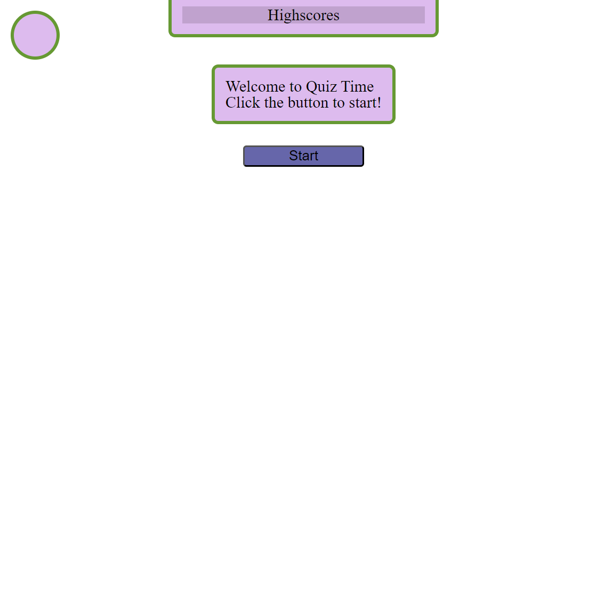

# Quiz-Time

## Web Developement Quiz Game

This page serves as a multiple choice question and anwser style quiz game designed to test the users knowledge of web developement concepts and syntax.

The quiz is timed and the user is scored at the end based on how much time is left on the clock when they finish. A wrong anwser will incur a -10 second penalty and display a tip for the correct anwser. If the timer ever hits 0, the quiz will end and the player will have scored 0 points.

After a round of questions, the user has the opportunity to submit their name along with their score to the highscore board. The player may view the highscore board at any time by clicking the tab at the top of the screen.

# Installation

N/A

# Usage

The web page can currently be found hosted on Github [here](https://stephen-bates.github.io/Quiz-Time/)

The page should resemble the image below:

## Credits

All HTML, CSS, and Javascript is entirely original and designed by myself

## Liscense

N/A